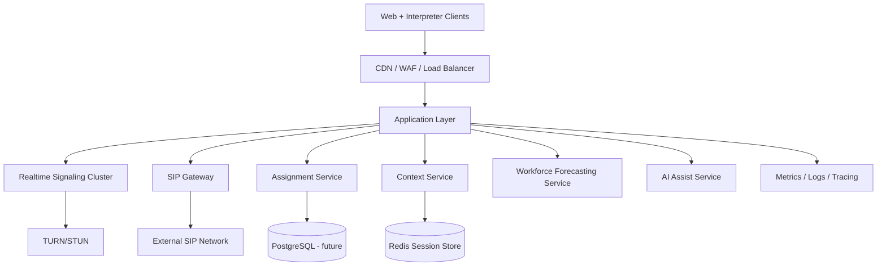

# Production Architecture (Starter)

## Flow Summary
1. User authenticates and opens client.
2. Client connects to signaling and requests call.
3. Assignment service provides interpreter candidate.
4. AI assist service provides optional suggestions.
5. Workforce forecasting service emits staffing forecasts.
6. SIP gateway bridges external calls when needed.
7. Context service stores session state in Redis.
8. TURN supports NAT traversal for media connectivity.
